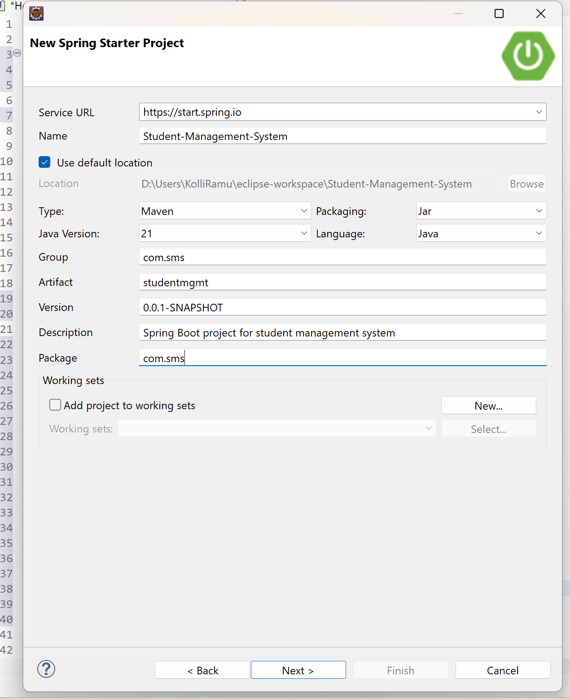
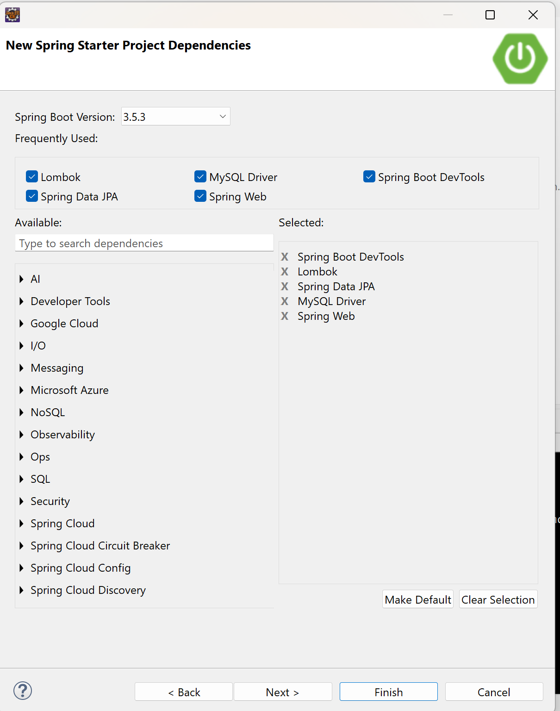
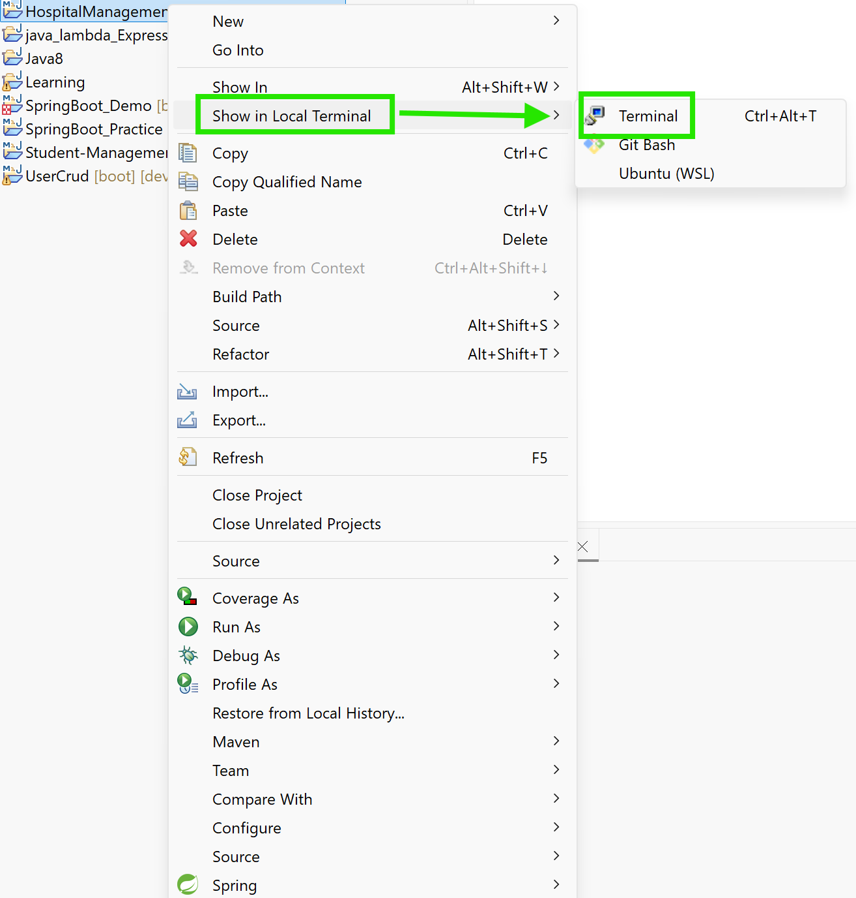

# Student-Management-System
## Ramu's Work
1. Create a new Repository in github with name ```student-management-system ```and add the Collaborators to it.
2. Create a new spring boot project with following steps

3. Now Add necessary dependencies for the project and create the project.

4. Now right click on the spring boot project select show in local terminal and select Terminal(show in local terminal--> Terminal).

5. Run the following git commands to initialize,add , commit add remote and push the code to repository.
````
git init 
git add .
git commit -m "updated Project"
git branch -M main
git remote add origin url
git push -u origin main
````
6. 

