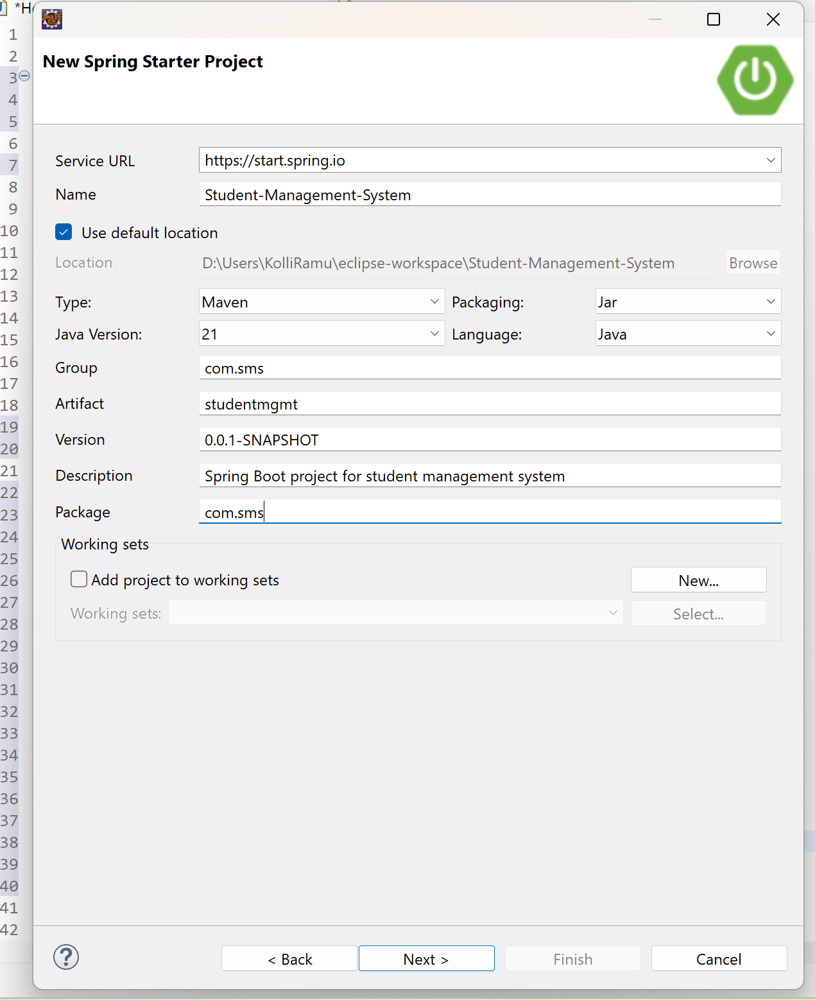
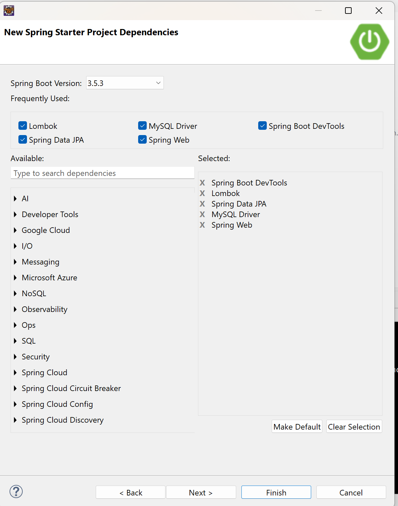
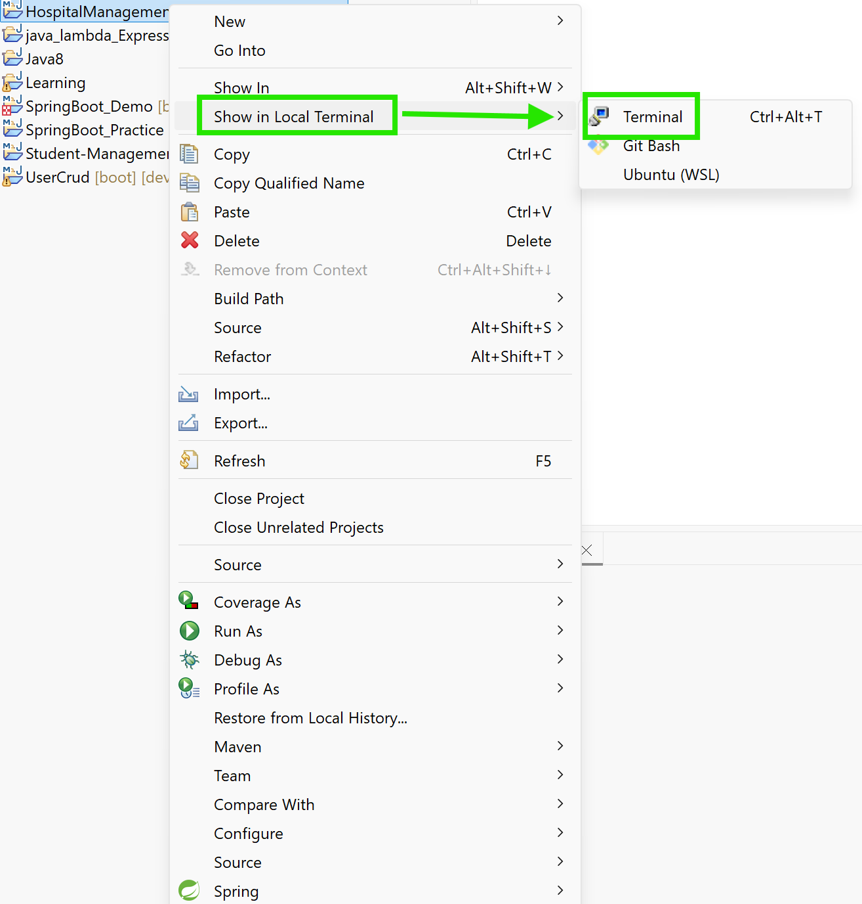
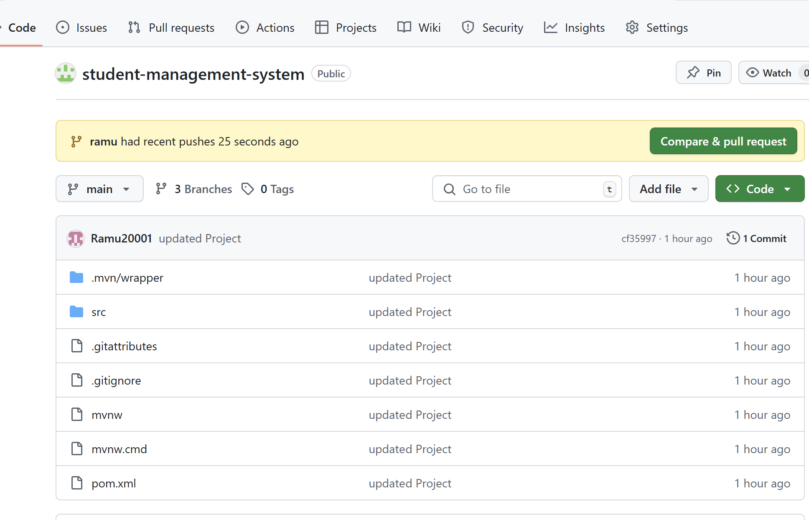
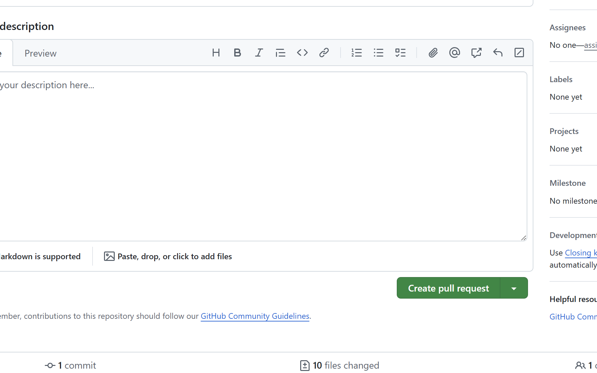
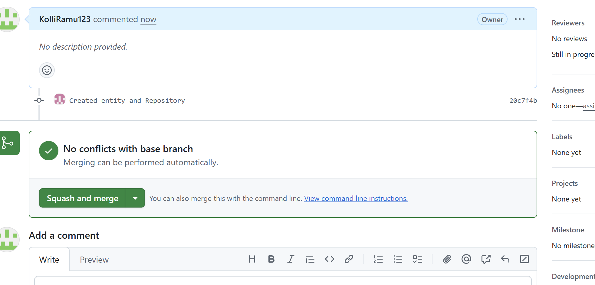

# Student-Management-System(Back End)
## Ramu's Work
1. Create a new Repository in github with name ```student-management-system ```and add the Collaborators to it.
2. Create a new spring boot project with following steps

3. Now Add necessary dependencies for the project and create the project.

4. Now right click on the spring boot project select show in local terminal and select Terminal(show in local terminal--> Terminal).

5. Run the following git commands to initialize,add , commit add remote and push the code to repository.
````
git init 
git add .
git commit -m "updated Project"
git branch -M main
git remote add origin url
git push -u origin main
````
6. create a new branch in github with name ramu and pull the code.
```
git pull
git checkout ramu
```
7. Create an entity, repository, exceptions packages and classes.
8. After completing the programming part push the code to remote repository
```
git add .
git commit -m "added changes"
git push -u origin ramu
```
9. After pushing the code to remote repository merge the changes to main branch.
10. Select the compare and pull request.

11. Now Select create pull request.

12.Now drop down and select the squash and merge.

13. Now we have successfully merge the changes to the main branch

## Nareshs Work


